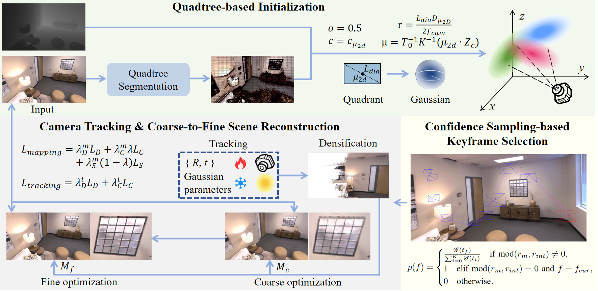

# [[ICME 2025](https://2025.ieeeicme.org/)] QCG-SLAM: Quadtree-based Condensed Gaussian Splatting for Visual SLAM

[Xun Fang](https://github.com/fangxun911)<sup>1</sup>, [Zixuan Hua](https://github.com/Moongod-Love)<sup>1</sup>, Xiao Zhao<sup>1</sup>, [Lihua Zhang](mailto:lihuazhang@fudan.edu.cn)<sup>1,2,3,*</sup>

<sup>1</sup> Academy for Engineering and Technology, Fudan University, Shanghai, China  
<sup>2</sup> Engineering Research Center of AI and Robotics, Ministry of Education, Shanghai, China  
<sup>3</sup> Jilin Provincial Key Laboratory of Intelligence Science and Engineering, Changchun, China  

<sup>*</sup> Corresponding author



## Abstract

Recent studies highlight the potential of 3D Gaussian Splatting in visual SLAM systems. However, current methods often initialize and densify Gaussians on a per-pixel basis, leading to redundancy and high storage demands. To address these limitations, we propose **QCG-SLAM**, an innovative Gaussian-based SLAM system introducing three key contributions: (1) a redesigned Gaussian initialization and densification process leveraging a quadtree segmentation scheme, effectively reducing the number of Gaussians required for scene representation; (2) a coarse-to-fine scene reconstruction paradigm that accelerates convergence and enhances rendering quality; and (3) a Confidence Sampling-based Keyframe Selection (CSKS) strategy that mitigates catastrophic forgetting and tracking cumulative error issues, demonstrating clear advantages in both accuracy and efficiency. Extensive experiments demonstrate that QCG-SLAM requires only **32.18%** of SplaTAM's memory on the Replica dataset and **25.70%** on the TUM-RGBD dataset on average, while maintaining state-of-the-art (SOTA) performance in camera tracking and scene reconstruction.

## Citation

If you find our work useful, please consider citing:

```bibtex
@inproceedings{fang2025qcgslam,
  title={QCG-SLAM: Quadtree-based Condensed Gaussian Splatting for Visual SLAM},
  author={Fang, Xun and Hua, Zixuan and Zhao, Xiao and Zhang, Lihua},
  booktitle={IEEE International Conference on Multimedia and Expo (ICME)},
  year={2025}
}
```
